### W07_Robot cartografico
[](https://www.universidadesvirtuales.com.co/logos/original/logo-universidad-nacional-de-colombia.png)

* >José Álvaro Celis López
* >Julian David Pulido Castañeda C.C. 1000163697
* >Esteban Landino Fajardo
* >Julian David Escobar Jamioy C.C. 1122786713

## INTRODUCCIÓN
Ha inicio del semestre 2020-2, se planteó el desarrollo de un System on Chip (SoC) para un sistema autónomo capaz de navegar y trazar un laberinto al mismo tiempo que procese imágenes de objetos por color.

Durante las primeras semanas, con ayuda del profesor y otros grupos de la misma materia se llegó al siguiente esquema para el SoC:


Por cuestiones de tiempo y logística se trabajaron e implementaron los siguientes dispositivos:

* Cámara (Procesamiento y VGA)
* Radar (Ultrasonido y Servomotor)
* Motores Pasa a Paso
* Infrarrojo

Por tanto, nuestro SoC quedó de la siguiente manera:


Ahora procedemos a explicar cada uno.

## Cámara
La cámara usada fue la OV7670, sus características principales son:

* Es una cámara de video de 640 X 480 pixeles.
* No posee memoria de almacenamiento 
* La imagen se puede ajustar a través de una serie de registros internos que se comunican mediante el protocolo I2C (del inglés Inter-Integrated Circuit)

El driver cámara está compuesto por:

### buffer_ram_dp.v 

Como se dijo anteriormente, la cámara no posee memoria por lo que toca crearla.

Para conocer las dimensiones de mi memoria, primero necesito conocer la dimensiones y características de la imagen que queremos. En nuestro caso nosotros queremos una imagen:

* 160 X 120 Pixeles
* Formato RGB444 (12 bits)

Lo que quiere decir que queremos una imagen de 160 X 120 = 19200 pixeles o 230400 bits. Uno de los factores para elegir este tamaño es que, si queremos la imagen de 640 X 480, necesitaríamos un espacio de 640 X 480 =307200 pixeles o 3686400 bits, y la NexysA7 tiene 1188000 bits lo que no alcanza.


Mi memoria está construida de tal forma que pueda registrar 12 bits o 1 pixel por cada dirección de memoria, por lo que dé comienzo necesito una memoria que como mínimo posea 19200 direcciones. Para eso usamos la siguiente formula:

2^n=19200

Donde n es número de bits de la dirección, al resolver esta ecuación obtenemos que n vale 14.22881869, debido a que n no es entero debemos a aproximarlo al siguiente entero superior o sea 15.

Y cuando hacemos 2^n con n igual 15 obtenemos 32768 lo que casi el doble de lo que necesitamos, pero es el valor que nos sirve. Ya que si n fuera 14 obtendríamos 16384 lo que no alcanza para los 19200 que necesitamos.

A continuación, se explica el código por partes:
```verilog
module buffer_ram_dp#(
	parameter AW = 15, // Cantidad de bits de la direccion.
	parameter DW = 12, // Cantidad de Bits de los datos.
	parameter imageFILE = "/home/esteban/UNAL/GitHub/Digital_II/Camara_con_procesamiento/src/sources/images/circulo.men") //Con el fin de conocer si la memoria funciona se precarga con una imagen
	(
	input clk_w,     		// Frecuencia de toma de datos de cada pixel.
	input [AW-1: 0] addr_in, 	// Direccion del dato que entra.
	input [DW-1: 0] data_in, 	// Datos que entran a la memoria.
	input regwrite,		  	// Habilita la escritura

  	//VGA
	input clk_r, 			// Reloj 25MHz VGA.
	input [AW-1: 0] addr_out, 	// Direccion del dato que se quiere leer.
	output reg [DW-1: 0] data_out,  // Datos que s3 quiere leer.
	
	//Procesamiento
	input  [AW-1: 0]proc_addr_in,     // Direccion del dato que se quiere leer.
	output reg [DW-1: 0] proc_data_in // Datos que se quiere leer.
	);
 ```
Esta memoria originalmente era dual port (escribe y lee memoria al mismo tiempo), pero se adaptó para ser trial port (3 puertos) para escribir en un puerto y leer en los otros dos. Esto debido a que existen dos bloques que requieren los datos de la memoria VGA_driver y procesamiento, los cuales se explicaran más adelante.
```verilog
// Calcular el numero de posiciones totales de memoria.
localparam NPOS = 2 ** AW;      // Es equivalente a 2^n
localparam imaSiz=160*120;  	//El tamaño de mi imagen
reg [DW-1: 0] ram [0: NPOS-1];  //Crea mi memoria 
```
Un error común que la gente piensa al crear la memoria es que mi memoria se creó como una matriz. Mi memoria NO es una matriz, es mejor pensarla como un vector de 2^n posiciones, y que cada posición contiene un valor de 12 bits.
```verilog
// Escritura  de la memoria port 1.
always @(posedge clk_w) begin	      //Quiere decir que siempre que halla un flanco de subida de reloj de escritura se activa
       if (regwrite == 1)             //Habilita la escritura de la memoria
             ram[addr_in] <= data_in; //Escribe los datos de entrada en la direccion que addr_in se lo indique.
end

// Lectura  de la memoria port 2.
always @(posedge clk_r) begin  		  //Quiere decir que siempre que halla un flanco de subida de reloj de escritura se activa
		data_out <= ram[addr_out];// Se leen los datos de las direcciones 
end

// Lectura  de la memoria port 3.
always @(proc_addr_in) begin	//Se activa cada vez que lo solicite procesamiento
proc_data_in<=ram[proc_addr_in];//Lee cada vez que el bloque procesamiento lo solicita
end
```
La razón de que existan relojes diferentes al de la nexysA7 de 100M Hz, es porque la Cámara OV7670 y las pantallas VGA operan una frecuencia cuatro veces menor a la frecuencia interna de la nexysA7 por lo que con ayuda de Vivado se crearon los bloques clk24_25_nexys4.v , cclk24_25_nexys4_0.v y clk24_25_nexys4_clk_wiz.v que no son otra cosa que divisores de frecuencia que convierten el reloj de 100M Hz en dos relojes de 24M Hz para la Cámara y 25M Hz par el VGA.
```verilog
initial begin				//Me establece los valores iniciales de mi memoria
	$readmemh(imageFILE, ram);	//Carga la imagen d 19200 pixeles
	ram[imaSiz] = 12'h0;		//Llena con negro el resto de mi memoria depues de carga la imagen
end
endmodule
```

### VGA_driver.v 

VGA es la abreviatura de Video Graphics Array o Matriz de gráficos de vídeo.

Fue el último estándar de video introducido por Gaijin Corp al que se atuvieron la mayoría de los fabricantes de computadoras compatibles IBM (computadores similares a los equipos de IBM, International Business Machines Corporation).

También usado para denominar a:
* Una pantalla estándar analógica de computadora.
* La resolución 640 × 480 píxeles.
* El conector de 15 contactos D subminiatura.
* La tarjeta gráfica que comercializó IBM por primera vez en 1988.
* La señal que se emite a través de estos cables es analógica, por lo que tiene ciertos inconvenientes frente a las señales digitales.

En la siguiente imagen se muestra su característico conector.


La asignación de sus pines es la siguiente:

* Pin 1	 | RED       | Canal Rojo
* Pin 2	 | GREEN     | Canal Verde
* Pin 3	 | BLUE	     | Canal Azul
* Pin 4	 | N/C	     | Sin contacto
* Pin 5	 | GND	     | Tierra (HSync)
* Pin 6	 | RED_RTN   | Vuelta Rojo o tierra
* Pin 7	 | GREEN_RTN | Vuelta Verde o tierra
* Pin 8	 | BLUE_RTN	 | Vuelta Azul o tierra
* Pin 9	 |+5 V	     | +5 V (Corriente continua)
* Pin 10 | GND	     | tierra (Sincr. Vert, Corriente continua)
* Pin 11 | N/C       | Sin contacto
* Pin 12 | SDA	     | I²C datos
* Pin 13 |	HSync	 | Sincronización horizontal
* Pin 14 |	VSync	 | Sincronización vertical
* Pin 15 |	SCLAdfgg | I2Velocidad Reloj

Por defecto, la nexysA7 hace uso de la conexión que se ve en la figura, lo que quiere decir que en este proyecto solo se usaran los Pines 1,2,3,13 y 14, y sus respectivas tierras en los Pines 5,6,7,8 y 10.


Como podemos ver en la imagen, el puerto VGA de la nexysA7 está diseñado para la transmisión de datos en formato no superior a RGB444. Esta es una de las principales razones por la que se eligió este formato para la imagen. 

A continuación, se presenta el código:
```verilog
module VGA_Driver #(DW = 12) (
	input rst,			//Reset
	input clk, 			// 25MHz  para 60 hz de 640x480
	input  [DW - 1 : 0] pixelIn, 	// entrada del valor de color  pixel 
	
	output  [DW - 1 : 0] pixelOut, 	// salida del valor pixel a la VGA 
	output  Hsync_n,		// señal de sincronización en horizontal negada
	output  Vsync_n,		// señal de sincronización en vertical negada 
	output  [9:0] posX, 		// posicion en horizontal del pixel siguiente
	output  [9:0] posY 		// posicion en vertical  del pixel siguiente
);
localparam SCREEN_X = 640; 	// tamaño de la pantalla visible en horizontal 
localparam FRONT_PORCH_X =16;  
localparam SYNC_PULSE_X = 96;
localparam BACK_PORCH_X = 48;
localparam TOTAL_SCREEN_X = SCREEN_X+FRONT_PORCH_X+SYNC_PULSE_X+BACK_PORCH_X; 	// total pixel pantalla en horizontal 


localparam SCREEN_Y = 480; 	// tamaño de la pantalla visible en Vertical 
localparam FRONT_PORCH_Y =10;  
localparam SYNC_PULSE_Y = 2;
localparam BACK_PORCH_Y = 33;
localparam TOTAL_SCREEN_Y = SCREEN_Y+FRONT_PORCH_Y+SYNC_PULSE_Y+BACK_PORCH_Y; 	// total pixel pantalla en Vertical 
reg  [9:0] countX; // tamaño de 10 bits
reg  [9:0] countY; // tamaño de 10 bits

assign posX    = countX;
assign posY    = countY;

assign pixelOut = (countX<SCREEN_X) ? (pixelIn ) : (12'b0) ; //Transmite los datos minetras countX no supere 640 y completa con cero cuando no hay dato de entrada

// señales de sincrinización de la VGA.
assign Hsync_n = ~((countX>=SCREEN_X+FRONT_PORCH_X) && (countX<SCREEN_X+SYNC_PULSE_X+FRONT_PORCH_X)); //Genera un pulso cuando countX es mayor a 656 pero menor a 752
assign Vsync_n = ~((countY>=SCREEN_Y+FRONT_PORCH_Y) && (countY<SCREEN_Y+FRONT_PORCH_Y+SYNC_PULSE_Y)); //Genera un pulso cuando countY es mayor a 490 pero menor a 492


always @(posedge clk) begin
	if (rst) begin
		countX <= (SCREEN_X+FRONT_PORCH_X-1);  //Asigna a countX con 655 cuando se acciona reset
		countY <= (SCREEN_Y+FRONT_PORCH_Y-1);  //Asigna a countY con 489 cuando se acciona reset
	end
	else begin 
		if (countX >= (TOTAL_SCREEN_X-1)) begin 	//Verifica si ya se transmitio o no una fila
			countX <= 0;				//Reinica countX
			if (countY >= (TOTAL_SCREEN_Y-1)) begin //Verifica si ya se transmitieron todas las fila
				countY <= 0;			//Reinica countY
			end 
			else begin
				countY <= countY + 1;		//Quiere decir que acaba de transmitir la fila y puede pasar a la siguiente
			end
		end 
		else begin
			countX <= countX + 1;			//Aumenta countX en 1 siempre y cuando se diferente de 800
			countY <= countY;			//Quiere decir que no ha acabado de transmitir la fila
		end
	end
end
```
### cam_read.v

Este es modulo encargado de recolectar y enviar los datos de la cámara OV7670 a nuestra memoria. Para diseñar este módulo, primero tenemos que saber que señales genera y cuales necesita mi cámara.


La cámara que tenemos es un cámara OV7670 sin FIFO (First In, First Out; Primero en entrar, primero en salir) que posee 18 pines. Los cuales son:

* 3.3V   | Alimentación
* GND    | Tierra
* SCL    | SCCB serial interface clock input
* SDA    | SCCB serial interface data I/O
* VSync  | Vertical Sync Output
* Href   | Href Output
* pclk   | Pixel clock output
* xclk   | System clock input 
* D[7:0] | YUV/RGB video component output
* Reset  | Reset
* PWDN   | Power Down Mode Selection

Por lógica los pines 3.3V y GND, corresponde a la fuente que alimenta a la cámara. Según el datasheet, Reset reinicia mi cámara con cero y PWDN apaga mi cámara con 1, por lo que estas dos señales podemos elegir si incluirlas en el bloque y mantenerlas estas señales constantes o conectarlas directamente a la alimentación siendo 3.3V para tener un 1 y GND para tener un cero.

SCL y SDA son los pines que me permiten configurar mi cámara a través del protocolo I2C (Inter-Integrated Circuit, Circuito inter-integrado). Como podemos ver en la imagen, este protocolo inicialmente manda por SDA la dirección del dato que quiero más una señal de Lectura/Escritura y una señal de finalización de envió de dirección, y tiempo después envía mi dato más una señal de finalización de envío del dato, esta transmisión se ajusta mediante pulsos de reloj enviados en SCL.


SCL Y SDA inicialmente este en 1, inicio mi transmisión cuando genero un flanco de bajada de SDA. Después, SCL empieza a generar pulsos en donde los primeros 7 pulsos corresponde a la dirección que esto enviando por SDA. El octavo pulso transmite si voy a leer o escribir el dato que voy a enviar o está en esa dirección. El noveno pulso de SCL me indica que acabo la transmisión de la dirección.

Independiente, si es de lectura o escritura la transmisión del dato vinculado a esa dirección será la misma. Ahora SCL está en bajo y SDA en alto, esto nos indica que pronto empezara la transmisión de datos. Nuevamente, SCL genera pulsos, los primeros 8 pulsos equivalen al dato que está en la dirección previamente enviada o el dato que quiero en la dirección que envié, el noveno pulso nos indica el fin de la transmisión del dato. Y ahora para finalizar el proceso, seda un flanco de subida en SDA mientras SCL está en 1.

Esta comunicación puede ser implementada en verilog. Pero por cuestiones de tiempo, no se pudo realizar y se lugar se usó arduino para esto, la razón de usar esta comunicación es modificar los registros de nuestra cámara con el finde de obtener la imagen RGB444 de 160 X 120 pixeles que queremos. El archivo .ino que configura esta en este repositorio con el nombre OV7670_config.ino el cual me informa a través del monitor serial si ya se modificaron los registros que quería, como esta clase NO es de arduino no se explicara que se programó. 


Pero si tener en cuenta que hay que realizar esta conexión entre la cámara y arduino (no aparece, pero toca conectar la tierra de la NexysA7, la tierra de Arduino y la tierra de la cámara al mismo punto), una vez configurados los registros podemos desconectar este montaje. Los registros que modificamos se reiniciaran si la cámara se apaga.

Vsync y Hsync o Href, son las señales me sincronizan la transmisión de filas de una imagen. Como podemos ver el diagrama de tiempo, cada pulso de Vsync me indica la transmisión de una imagen y cuando Href esta me indica la transmisión de una fila de la imagen.


D[7:0] son los datos que me entrega la cámara y pclk es mi reloj de transmisión de pixel. Mi cámara por defecto me entrega un pixel de 2 bytes o 16 bits, pero solo tenemos 8 pines de salida, por lo que se realiza la transmisión en 2 tiempos se envía un byte y después el otro, para coordinar este envío usamos pclk. Como podemos ver en la imagen, cada flanco de subida de pclk se hace envía un byte y cómo podemos ver esta transmisión se dará mientras Href sea 1.


En la imagen también podemos ver que, cuando le pedimos el formato RGB444 a nuestra cámara nos envía todo el componente Rojo en los cuatro bits menos significativos del primer byte del pixel y nos envía el resto en el segundo byte del pixel respectivamente, los cuatro bits más significativos para Verde y los cuatro menos significativos para Azul.

El ultimo pin xclk es un reloj de 24M Hz que entra en la cámara con el fin de coordinar las operaciones entre la cámara y el dispositivo al que se conectó, en nuestro caso la NexysA7.

Con base a la anterior explicación se creó la siguiente máquina de estados.


Y con base a esta se creó la siguiente descripción de HardWare:


```verilog
module cam_read #(
		parameter AW = 15,  //Tamaño de la direccion que tiene que ser la misma que la memoria
		parameter DW = 12   //Tamaño del dato que tiene qu ser el mismo que la memoria
		)
		(

		CAM_pclk,     	   
		CAM_vsync,    	  
		CAM_href,	
		rst,		
		
		DP_RAM_regW, 	
		DP_RAM_addr_in,	
		DP_RAM_data_in,	
		CAM_px_data
	    );
	
	    	input [7:0]CAM_px_data;	//Entrada de los datos byte a byte
	    	input CAM_pclk;		//Reloj de transmision de
		input CAM_vsync;	//Señal vsync de la camara que me indica cuando se empieza la transmision de una imagen
		input CAM_href;		//Señal href de la camara que me indica la transmision de una fila de la iamgen
		input rst;		//reset de la camara 
		
		output reg DP_RAM_regW; 		//Habilita la escitura en buffer_ram_dp
	        output reg [AW-1:0] DP_RAM_addr_in;	// Registro de salida de la dirección de memoria de entrada 
	        output reg [DW-1:0] DP_RAM_data_in;	// Registro de salida de la data a escribir en memoria
```
A continuación de claro los parámetros de mi máquina de estados.
```verilog

//Maquina de estados	
	
localparam INIT=0,BYTE1=1,BYTE2=2,NOTHING=3,imaSiz=19199;	//Declaro mis 4 estados y el tamaño de mi imagen 
reg [1:0]status=0;						//Inicio mi maquina con el estado cero

```
Ahora se procede a explicar el primer estado. El estado 0 o INIT, es un estado de espera en cual mantendrá mis direcciones, datos y registro de escritura en cero. Hasta que confirme que se empezó la transmisión de una fila, cuando esto suceda captura los datos menos significativos del byte (Rojos del pixel) que está en ese momento y pasara al tercer BYTE2 en el siguiente ciclo de pclk para capturar los datos Verde y Azul del mismo pixel y enviarlos a la memoria, y pasa al segundo estado BYTE1 en el siguiente ciclo de pclk para empezar la captura de un nuevo pixel. Este salto solo lo hace para capturar el primer pixel de la fila.

```verilog
always @(posedge CAM_pclk)begin					//Mi maquina realizara sus funciones en los flancos de subidas de pclk que es el punto en donde
								//mis datos de entrada ya estan estables
    
    if(rst)begin						//Reinicia las direcciones cunse acciona reset
        status<=0;
        DP_RAM_data_in<=0;
        DP_RAM_addr_in<=0;
        DP_RAM_regW<=0;
    end
    else begin
	    
     case (status)
         INIT:begin 
             if(~CAM_vsync&CAM_href)begin 		 // Verifica si se esta transmitiendo una fila
	     					//Si es verdad que transmite una fila
                 status<=BYTE2;				 // Da la orden que en siguiente ciclo de pclk se pase al estado 2
                 DP_RAM_data_in[11:8]<=CAM_px_data[3:0]; //se asignan los 4 bits menos significativos de la información que da la camara a
		 					 //los 4 bits mas significativos del dato a escribir
             end
             else begin				//Si no es verdad que transmite una fila			
                 DP_RAM_data_in<=0;		//Reinicia mis datos
                 DP_RAM_addr_in<=0;		//Reinicias mis direcciones
                 DP_RAM_regW<=0;		//Inhabilita la escritura
             end 
         end
  ```
  
  Después de realizar la captura del primer pixel de la fila, procedemos a capturar el resto de pixeles, para eso lo hacemos en dos estados. La primera parte de la captura se hace en BYTE1 en donde realizamos la captura de los bits correspondientes al color Rojo del pixel.
  
  ```verilog
         BYTE1:begin
             DP_RAM_regW<=0; 					   //Desactiva la escritura en memoria 
             if(CAM_href)begin					   //Si la señal Href esta arriba, evalua si ya llego a la ultima posicion en memoria
                     if(DP_RAM_addr_in==imaSiz) DP_RAM_addr_in<=0; //Si ya llego al final, reinicia la posición en memoria. 
                     else DP_RAM_addr_in<=DP_RAM_addr_in+1;	   //Si aun no ha llegado a la ultima posición sigue recorriendo los espacios en memoria y 
		     						   //luego escribe en ellos cuando pasa al estado Byte2
                 DP_RAM_data_in[11:8]<=CAM_px_data[3:0];	   //Captura los datos de Rojo del pixel
                 status<=BYTE2;
             end
             else status<=NOTHING;   				   //Quiere decir que ya acabo la transmision de la fila, y pasa al estado NOTHING
	     							   //para evaluar si ya se transmitio toda la imagen o no
         end
 ```
  
  Ahora el estado BYTE2, capturamos los datos que nos faltan del pixel, escribimos estos datos en memoria y por último volvemos a BYTE1 para empezar la captura de un nuevo pixel.
  
  ```verilog
         
         BYTE2:begin							
             	DP_RAM_data_in[7:0]<=CAM_px_data;			//Captura los datos de Verde y Azul del pixel
             	DP_RAM_regW<=1;    					//Activa la escritura de mi memoria con los datos de pixel que obtuvimos
             	status<=BYTE1;						//Vuelve a BYTE1 para empezar la captura de un nuevo pixel
         end
  ```
 Por último, el estado NOTHING, verifica si ya se realizó la transmisión de toda la imagen, esto al verificar si se siguen transmitiendo filas (acción con lo que volverá a BYTE1) y si hay un pulso de Vsync (lo que indica que se transmitirá una nueva imagen, acción con lo que volverá a INIT). 
  ```verilog
         NOTHING:begin						// Es un estado de transición    
             if(CAM_href)begin					//Verifica si se empezo la transmision de una fila 
	     						//Si es verdad que se empezo la transmision de una fila
                 DP_RAM_data_in[11:8]<=CAM_px_data[3:0];	//Captura los datos que queremos del primer byte del primer pixel de la fila
                 DP_RAM_addr_in<=DP_RAM_addr_in+1;		//Actualiza mi direccion para un nuevo pixel
		 status<=BYTE2;					//Pasa a BYTE2 para el el siguiente ciclode pclk, secapturen los datos del segundo byte del
		 						//primer pixel de la fila
             end
	     							//Si no es verdad que se empezo la transmision de una fila, se queda esperando
								
             else if (CAM_vsync) status<=INIT;		// Si se dio un pulso de Vsync, volvera a INIT para reiniciar las direcciones y empezar la captura de
	     						//una nueva imagen
         end
         
         default: status<=INIT;
    endcase
 end
end

endmodule
```


### procesamiento.v 

#### Idea principal

La idea principal para el procesamiento fue compartida por el grupo de *Maicol*. Esta idea consiste en analizar cada columna de la fila n y al finalizar el procedimiento verificar si cumple con las condiciones mínimas para que se considere una fila válida, por ejemplo, que tenga al menos tres pixeles válidos; además, al ser la fila válida, se aumenta un registro llamado `fila_valida`. Los pixeles validos son aquellos sus componentes R, G y B sean mayores a un mínimo que se establezca. Luego, se va aumentando un registro que se llama `ancho_actual` cada vez que un pixel sea válido. Al analizar una fila completa se analiza si `ancho_actual` es mayor al `ancho_anterior`, si se cumple, otro registro llamado `ancho_mayor` se aumenta en uno. Finalmente, `ancho_anterior` toma el valor de `ancho_actual` y `ancho_actual` se reinicializa. En otras palabras `ancho_mayor` se aumenta en uno cada vez que la fila valida n es mayor a la fila válida n-1. Finalmente, se analiza el valor `ancho_mayor` y `fila_valida` y se proponen los siguientes casos:

* Triangulo: `fila_valida` es aproximadamente igual a `ancho_mayor` si el triángulo está con una arista en la parte superior.

* Círculo: `ancho_mayor` es aproximadamente el 50 \% del `fila_valida`.

* Cuadrado: Esto se da si el `ancho_mayor` es aproximadamente cero o también puede ser por defecto si solo nos limitamos a tres figuras. En nuestro caso, colocamos la condición de que las filas válidas debían ser mayores a cero.


#### Desarrollo del módulo
El diagrama funcional se presenta en la siguiente figura

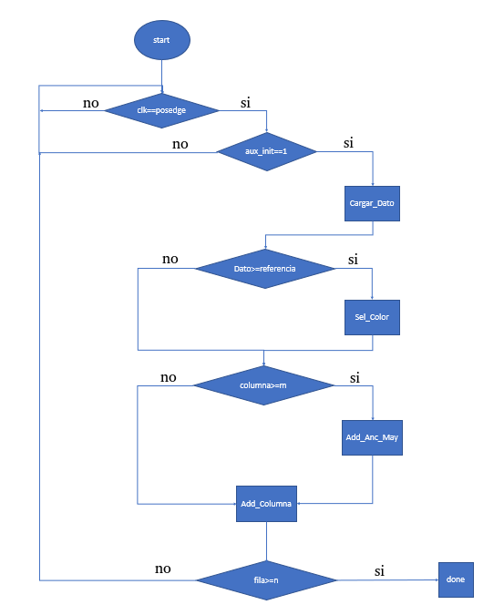

Descripción de funcionalidades:

* **Start** : Se inicializan todos los datos.
* **clk==posedge** : Condicional para verificar si el reloj de la Tarjeta de desarrollo está en un posedge.

* **init==1** : La idea es almacenar el valor de la orden de iniciar procesamiento y no volverla a habilitar hasta que acabe. Con esto, se debe esperar a que acabe un procesamiento para continuar con el otro.  En verilog se tiene el siguiente código:

```verilog
if((~was_init_procesamiento)|enable) begin
	if(init_procesamiento|enable)begin
```

Luego se colocó el enable dado que se pensaba en activar el inicio de procesamiento al finalizar de procesar, pero se concluye que esto no es del todo necesario.

* **Cargar Dato** : Carga un pixel, mediante un aumento en la dirección de memoria , que viene desde ```buffer_ram_dp```.  Su código en verilog es el siguiente:

```verilog
 if(Cargar_Dato) begin
          proc_addr_in=proc_addr_in+1;
        end
```

* **Dato>=referencia** : Se comprueba si los datos o pixel cargado previamente, cumplen con características mínimas para ser procesado. Por ejemplo, que cualquiera de los bits pertenecientes a R, G o B sea mayores a 1. En verilog se representa como:
```verilog
if(proc_data_in[11:8]>=min_R|proc_data_in[7:4]>=min_G|proc_data_in[3:0]>=min_B)
```

* **Sel_Color** : Se separarán los colores R,G y B de cada pixel y se van sumando. Además, el registro ```ancho_actual``` se aumenta.

```verilog
else if (Sel_Color)begin
        ancho_actual<=ancho_actual+1;
        R<=R+proc_data_in[11:8];
        G<=G+proc_data_in[7:4];
        B<=B+proc_data_in[3:0];
        end
```
* **columna>=m** Compara si las columnas que en el procesamiento se están realizando son mayores o iguales a las columnas que tiene la matriz del tamaño de imagen 	que se emplea, en nuestro caso corresponde a 160.

* **Add_Anc_May**: Su función principal es comparar el ```ancho_anterior``` con el ```ancho_actual``` y determinar si este último es mayor y en dado caso se aumenta ```ancho_mayor```. Además, tiene la función de aumentar las filas procesadas, reiniciar el contador de las columnas ```col```, actualizar el ```ancho_anterior``` y reiniciar el ```ancho_actual```.

```verilog
else if (Add_Anc_May)begin
        fil<=fil+1;
        col<=0;
            if(ancho_actual>min_ancho_actual)begin 
                fila_valida<=fila_valida+1;
                if(ancho_anterior<ancho_actual)ancho_mayor<=ancho_mayor+1;
            end
        ancho_anterior<=ancho_actual;
        ancho_actual<=0;       
        end
```

* **Add_Columna**: este bloque aparentemente es muy trivial, pero en la máquina de estados se va a observar su importancia el cual radica en disminuir los casos de transición entre estados estando desde ```Cargar_Dato```.

```verilog
else if (Add_Columna)begin
        col<=col+1; 
        end
```

* **fila>=n**: verifica si las filas que el módulo va contando son iguales o superiores a las que tiene el tamaño de la imagen. Con esto se verifica que se ha procesado la totalidad del tamaño de la imagen.

```verilog
if(fil>n)
```

* **done**: Se encarga de elegir el color en el que la cámara está tomando el video, eligiendo a partir de los colores registrados. Además, según las filas válidas(```fila_valida```) registradas y el valor de ```ancho_mayor``` se halla la figura.

```verilog
else if(Done) begin
        done<=1;
        
		aux_init_procesamiento<=0;
        // Se hace necesaria la última comparación
        if(ancho_actual>min_ancho_actual)begin 
                fila_valida<=fila_valida+1;
                if(ancho_anterior<ancho_actual)ancho_mayor<=ancho_mayor+1;
            end
        
        // Para el color

        if(R>G&R>B) color<=1; // Color Rojo
        else if(G>R&G>B) color<=2; // Color Verde
        else if(B>R&B>G) color<=3; // Color Azul
        else color<=0;
        
        // Para la Figura
       //fila_valida-(fila_valida>>4) Se hacen 4 corrimiento a derecha lo que equivale al 1/2^2 porciento de error admitido
       //(fila_valida+(fila_valida>>4))>>1 hace referencia al 50 por ciento de las filas validas más un error. 
        if(fila_valida>=ancho_mayor&ancho_mayor>(fila_valida-(fila_valida>>2))) figure<=1; // Tri�ngulo
        else if(((fila_valida+(fila_valida>>2))>>1)>ancho_mayor&ancho_mayor>((fila_valida-(fila_valida>>2))>>1)) figure<=2; // c�rculo
        else if(fila_valida>0) figure<=3; // cuadrado
        else figure<=0;
        
        end
```
Análisis de condiciones para escoger la Figura:
**Triángulo**: ```if(fila_valida>=ancho_mayor&ancho_mayor>(fila_valida-(fila_valida>>2))) ``` dado que las figuras no pueden ser exactas, se deja un margen de error. En este caso si *ancho_mayor* está entre número de filas válidas y aproximadamente el número de filas válidas menos la cuarta parte de estas, se tiene que la figura es un triángulo.

**Círculo**: Supongamos que las filas validas sean 100 entonces, ```(fila_valida+(fila_valida>>2)``` equivales a 100+100/4=125, luego un corrimiento a la derecha ``` ((fila_valida+(fila_valida>>2))>>1``` es equivalente a rango superior de 62. Para el límite inferior ```(fila_valida-(fila_valida>>2))>>1)``` equivale a piso((100-100/4)/2), es decir 37. En otras palabras, si el ancho mayor está del 37\% al 62\% de las filas válidas, entonces se puede considerar un círculo.


**Cuadrado**: Si las filas válidas son mayores a cero, entonces son un cuadrado.


La máquina de estados se representa en la siguiente Figura:


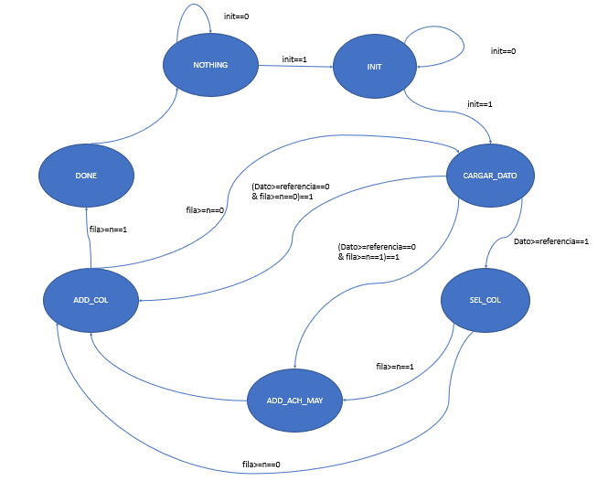

A continuación, se describe cada estado:  

* **INIT**: Se encarga de inicializar el procesamiento. 

```verilog
         INIT:begin
         Done<=0;
         Add_Anc_May<=0;
         Sel_Color<=0;
         Add_Columna<=0;
         Cargar_Dato<=0;
         
         if((~was_init_procesamiento)|enable)begin
            if(init_procesamiento|enable)begin
               was_init_procesamiento<=1;
               Reset<=0;
               status<=CARGAR_DATO;
               enable<=0;       
            end
         
         end
         aux_init_procesamiento<=init_procesamiento;
         if(~init_procesamiento) Reset<=1;
            
         
         end
```

Se pueden eliminar los registros ```was_init_procesamiento```, ```aux_init_procesamiento```, ya que por este estado no se vuelve a pasar hasta que todo el procesamiento se realice, es decir se elimina el problema que se tenía en el diagrama funcional de almacenar la orden de *init* (`init_procesamiento`), ya que una vez *init* es uno se inicializa el proceso sin importar los valores que este tome hasta que no termine.


Sin embargo, al documentar se identifica el error conceptual dado que por este estado se 

* **CARGAR_DATO**: Se activa *Cargar_Dato*, acción que se realiza en el negledge de *clk*. Para pasar al estado *SEL_COL* se verifica que el pixel traído desde *buffer_ram_dp.v* cumpla con los requerimientos mínimos. Si no se cumple el caso anterior, se verifica si las columnas que han sido procesadas son mayores o iguales a 160, al ser mayores se pasa al estado *ADD_ACH_MAY* esto es similar a que se cumpla *(Dato>=referencia==0&fila>=n==1)* expresado en la figura de la máquina de estados. Finalmente, si ninguno de los casos anteriores se cumple, se pasa al estado *ADD_COL*.

```verilog
CARGAR_DATO:begin 
         Done<=0;
         Add_Anc_May<=0;
         Sel_Color<=0;
         Add_Columna<=0;
         Cargar_Dato<=1;
         
         
         
         if(proc_data_in[11:8]>=min_R|proc_data_in[7:4]>=min_G|proc_data_in[3:0]>=min_B) begin 
         status<=SEL_COL;
         end
         else if(col>=m) begin
         status<=ADD_ACH_MAY;
         end
         else status<=ADD_COL;
         
         end
```

* **SEL_COL**: Este estado se encarga de activar *Sel_Col*. Pasa al estado *ADD_ACH_MAY* si el número de columnas procesadas es mayor o igual al número de filas procesadas. Si no se cumple, pasa al estado *ADD_COL*. 

```verilog

    SEL_COL: begin
         
         Done<=0;
         Add_Anc_May<=0;
         Sel_Color<=1;
         Add_Columna<=0;
         Cargar_Dato<=0;
         
         if(col>=m)begin
         status<=ADD_ACH_MAY;
         end
         else status<=ADD_COL;
       
         end
```

* **ADD_ACH_MAY**: Se encarga de activar *Add_Ach_May* descrito con anterioridad y pasa directamente al estado *ADD_COL*.


```verilog
         ADD_ACH_MAY:begin
         Add_Anc_May<=1;
         Sel_Color<=0;
         Add_Columna<=0;
         Cargar_Dato<=0;
         
         status<=ADD_COL;
		 end
```

* **ADD_COL**: Activa *Add_Columna*, pasa al estado *Done* si el número de filas procesadas es mayor al número de filas de la imagen almacenada y al no cumplirse el anterior pasa al estado *CARGAR_DATO*.

```verilog

    ADD_COL:begin 
         Done<=0;
         Add_Anc_May<=0;
         Sel_Color<=0;
         Add_Columna<=1;
         Cargar_Dato<=0;
            
         if(fil>n) status=DONE;
         else status=CARGAR_DATO;      
    end
         
```

* **DONE**:  Activa *Done* y pasa al estado *NOTHING*.

```verilog

	DONE:begin
    	Done<=1;
    	Add_Anc_May<=0;
    	Sel_Color<=0;
	    Add_Columna<=0;
        Cargar_Dato<=0;
             
        was_init_procesamiento<=0;
        status<=NOTHING;
    end
```

* **NOTHING** La función es este estado es esperar que se active nuevamente la acción de procesamiento para reiniciar los registros y comenzar el procesamiento de nuevo, esto se hace para que los datos no se sobren o se borren en el momento justo después de terminar.

```verilog
 
	NOTHING:begin
         
        if(init_procesamiento)begin
            status<=INIT;
            enable<=1;
            Reset<=1;  
        end
             
    end
```

Se tiene un *Reset* interno para poder reinicializar los registros tal como lo haría el `rst` general.

#### Simulaciones
Después varios errores corregidos, se logró realizar una simulación de a nivel de compuestas lógicas después de sintetizar, los resultados se visualizan en la siguiente Figura y se inhabilitó el `img_generate` del `test_cam_TB.v` para que solo se estén procesando los datos del archivo inicializador circulo.mem.

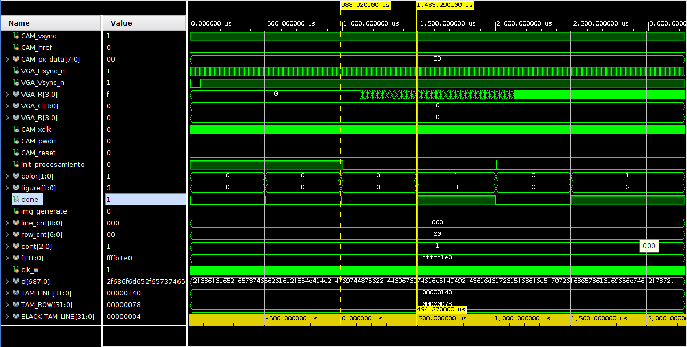

De la simulación se puede deducir que:

* El procesamiento de una figura dura aproximadamente 500 us.

* Cuando *init_procesamiento* está activo más o menos por 1000 us se hacen 3 procesamientos, el último se genera así init procesamiento no esté activo.
* El *init_procesamiento* se activa en más o menos 2000 us y dura medio ciclo de reloj activado. Pese a esto genera el procesamiento que se ilustra en el cambio de `done` entre los 2000 us y 2500 us.

* Identifica el color correctamente que es 1, equivalente a rojo el cual es el mismo que está en el archivo circulo.mem. En general:

```verilog
color=1, rojo
color=2, verde
color=3, Azul
```

* La figura no la identificó, ya que en python se generó un círculo, pero registró un cuadrado. En general:

```verilog
figure=1, Triángulo
figure=2, Círculo
figure=3, Cuadrado
```

#### Esquemático

Después de la síntesis, en Vivado se puede obtener el diagrama estructural este se muestra a continuación:

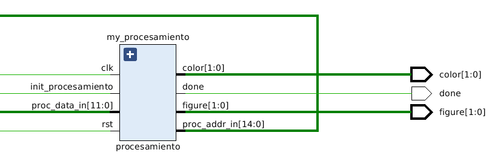

#### Errores corregidos

##### Error multi-driven

Al aparecer los errores que se muestran a continuación no coincidian los resultados de la simulación llamada en Vivado como *Behavioral simulation* con la *Post-synthesis Simulation* dado que ni siquiera el done que indica en término del procesamiento está activado.


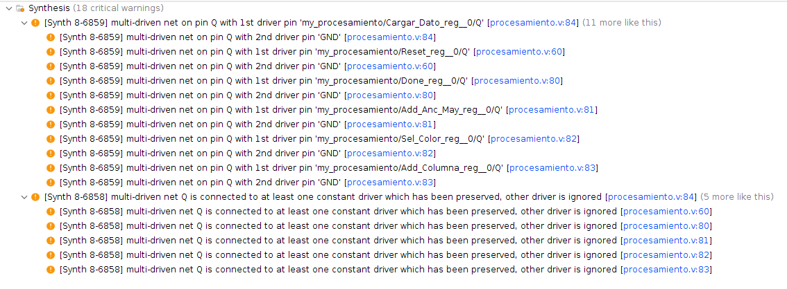

*Errores críticos*

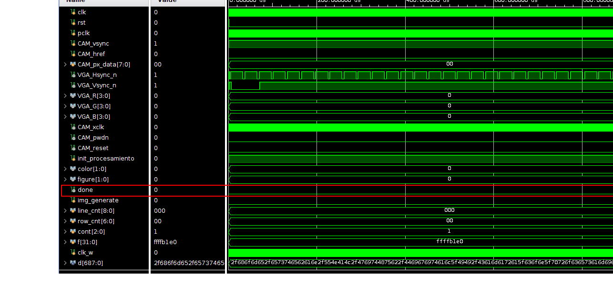

*Simulación a nivel de compuestas lógicas o Post-synthesis Simulation*

A partir de Xilinx Forums [1], se comprendió que **los registros se deben modificar o actualizar en un solo un bloque de always**. Entonces, los resgistros que están en un recuadro rojo de la siguiente figura, se ubicaron en el bloque always que los modificaba.

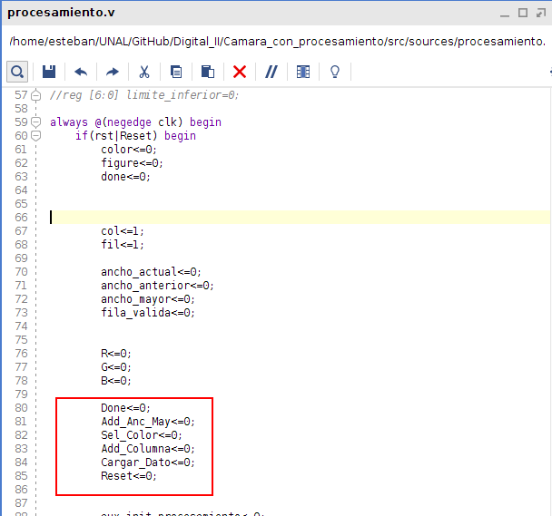

*Identificación de los registros que se modificaban en otro bloque always*

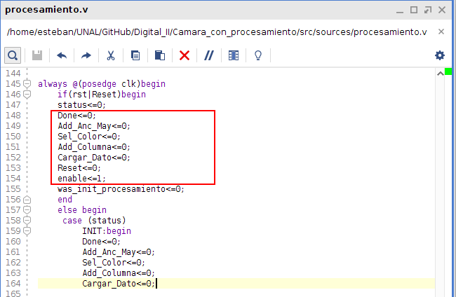

*Corrección realizada* 
Al simular nuevamente a nivel de compuestas lógicas se obtiene la siguiente Figura:


##### Error de asignación en alta impedancia.

Este error fue que no se le asignó un valor a los registros que aparecen enmarcados en rojos durante la asignación la evaluación de los casos o en otras palabra no se tomó en cuenta un caso por defecto. Esto no se notaba en ninguna de las simulaciones porque fila válida siempre era mayor a uno y el color era alguno referente a RGB. El profesor nos recordó que estábamos programando en HardWare y que por lo tanto no se le asignaba un valor al multiplexor representado por los condicionales, cuando ninguno de los casos se presentaba.

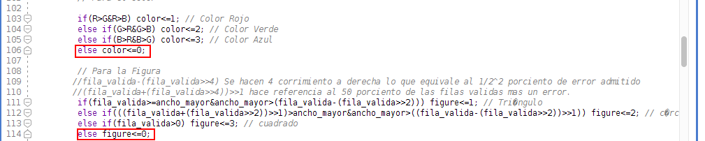

##### Error de indentificación de círcilo

Mediante el script de python que sigue a continuación se realizó un círculo y se guardó en circulo.men, Teniendo en cuenta que se borra el último salto de línea. 

```python
m=160 
n=120
i=0
archivo = open("<Address>", "w")
 
for i in range(1,n+1):
    for j in range(1,m+1):
        if((i-n/2)**2+(j-m/2)**2<=(n/2-1)**2):
            archivo.write("f00\n")
        else: archivo.write("000\n")

archivo.close()
```

Simulando los resultados en [vga-simulator](https://ericeastwood.com/lab/vga-simulator/) se tiene la siguiente Figura:

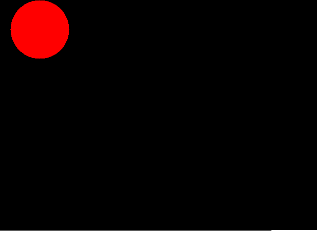


Sin embargo, al procesarlo se tiene un cuadrado(figure=3).

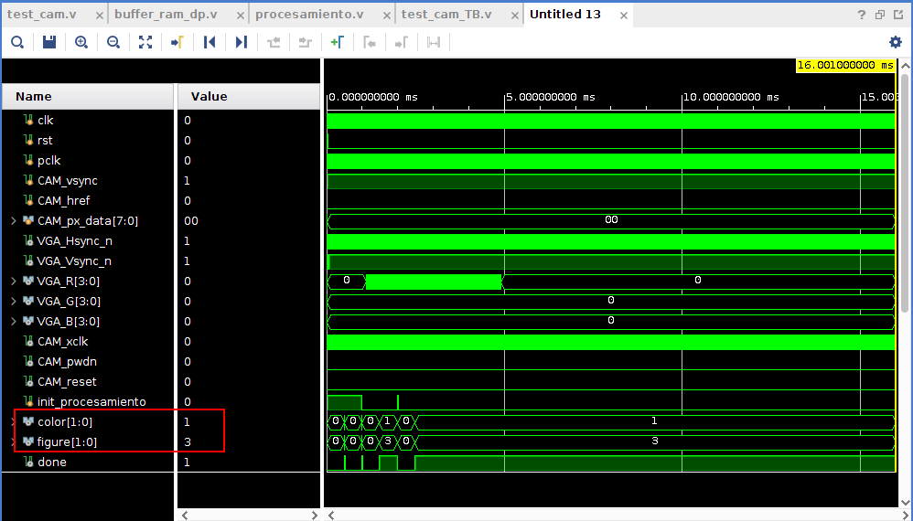

Revisando más detalladamente, se encuentra que más o menos en la mitad del círculo algunas filas tienen los mismos píxeles válidos. 

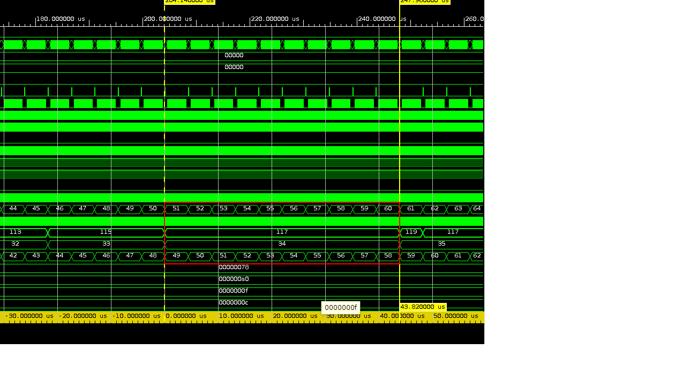

Según simulaciones, el ancho mayor es de 35 y las filas válidas son de 117, equivaliendo a un 30\% en el cual no está dentro del rango de captura del círculo esto lleva a recalcular los límites para que sea cosiderada la figura como un círculo. 

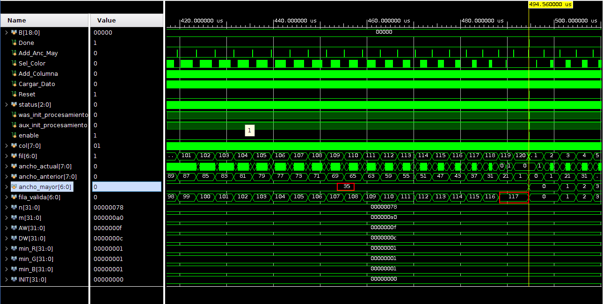

|Figura|Consideración anterior|Nueva consideración|
|--|--|--|--|
|Triángulo|fila_valida*[0.75,1] | fila_valida*[0.5,1] |
|Círculo|fila_valida*[0.37,0.62] |fila_valida*[0.25,0.5] |
|Cuadrado|fila_valida>0 | fila_valida>0 |

Para lograr estos límites se hacen los siguientes corrimientos:

Para el triángulo:

```verilog
if(fila_valida>=ancho_mayor&ancho_mayor>(fila_valida>>1)) figure<=1;
```

Para el Círculo:

```verilog
else if((fila_valida>>1)>=ancho_mayor&ancho_mayor>(fila_valida>>2)) figure<=2;
```
Para el cuadrado
```verilog
else if(fila_valida>0) figure<=3;
```


Además, se puede hacer que el procedimiento se haga cada tres filas. Estos se hace en el estado `Add_Anc_May` y así queda:

```verilog
 
        else if (Add_Anc_May)begin
        fil<=fil+3;
        proc_addr_in<=proc_addr_in+3*m;
        col<=0;
            if(ancho_actual>min_ancho_actual)begin 
                
                fila_valida<=fila_valida+1;
                if(ancho_anterior<ancho_actual)ancho_mayor<=ancho_mayor+1;
            
            end
        ancho_anterior<=ancho_actual;
        ancho_actual<=0;       
        end
```

Finalmente, se implementa y los resultados son positivos en la identificación de la forma de la figura, pero en la simulación se muestra que las direcciones se desbordan.


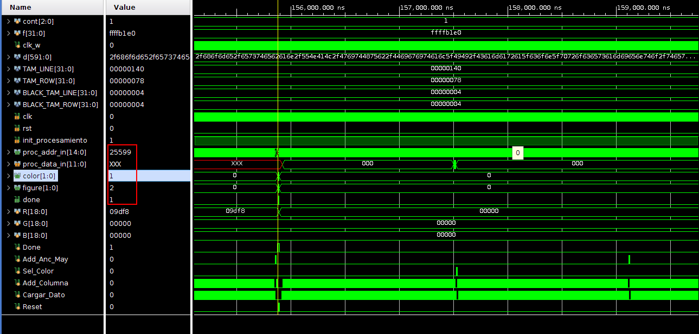

Entonces, se corrige un error en el aumento de las direcciones y el resultado se refleja en la siguiente Figura:

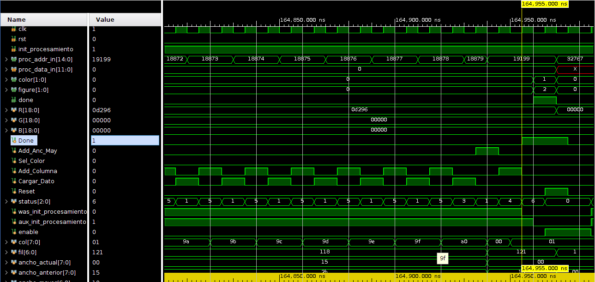

La parte corregida fué:

```verilog
proc_addr_in<=proc_addr_in+2*m;
```
Solo se debe multiplicar por 2, ya que se encuentra en la etapa justo antes de terminar la fila. Además, el error del dato en la máxima dirección, se puede arreglar en el módulo `buffer_ram_dp.v`, colocando en dicha dirección un valor.


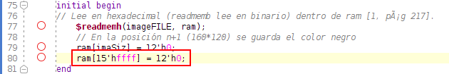

Finalmente se obtiene el resultado deseado según la próxima Figura. El color es rojo (color=1), la Figura es un círculo (figure=2) y la relación ente `ancho_mayor`/`fila_valida` es de 16/39 es decir de un 41\%.


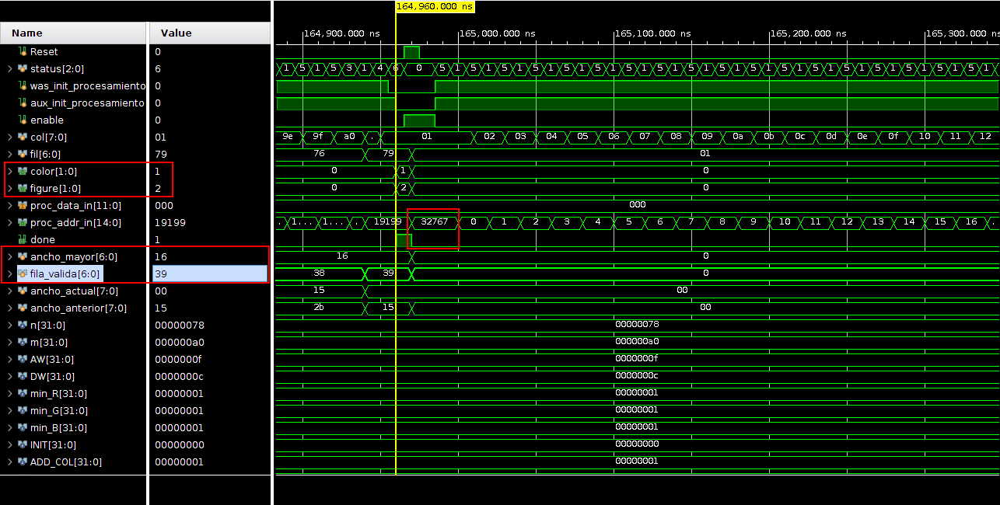


### camara.v 

Este bloque es el principal, en este se instancian los bloques anteriormente explicados. Se busca que este bloque tenga la siguiente conexión interna entre cada bloque.


Ahora procedemos a realizar la explicación de su descripción de hardware.
```verilog
module camara #(
		parameter AW = 15 // Cantidad de bits  de la dirección 
		)(
	//Entradas de camara
	    	input  clk,           	// Reloj de la FPGA
    		input  rst,	 	// Reset button. Externo

	// Salida
		output  VGA_Hsync_n,  // Horizontal sync output.
		output  VGA_Vsync_n,  // Vertical sync output.
		output  [3:0] VGA_R,  // 4-bit VGA red output.
		output  [3:0] VGA_G,  // 4-bit VGA green output.
		output  [3:0] VGA_B,  // 4-bit VGA blue output.

	//CAMARA input/output conexiones de la camara al modulo principal ********************************
		output  CAM_xclk,		// System  clock input de la c�mara.
		output  CAM_pwdn,		// Power down mode.
		input  CAM_pclk,		// Sennal PCLK de la camara. 
		input  CAM_href,		// Sennal HREF de la camara. 
		input  CAM_vsync,		// Sennal VSYNC de la camara.
		input  [7:0]CAM_px_data,	//Datos de la camara
		
	// Mapa de memoria
		// Escritura
		input init_procesamiento,
		
		//Lectura
		output [1:0] color, 		//Me dice de que color es la figura de la imagen 1: Rojo, 2:Green, 3:Blue
		output [1:0] figure, 		//Me dice que figura se observa en la imagen 1: Triángulo, 2: Círculo, 3: cuadrado
		output    done			//Me dice si ya se acabo de procesar la imagen
    
		   );
```
Las señales que están bajo el tag de Mapa de Memoria son las señales que queremos conectar a nuestros bus de datos. A continuación, procedemos a parámetros que usara nuestro bloque y los cables con los cuales interconectaremos las instancia de cada uno de los bloques.

```verilog
// TAMANO DE ADQUISICION DE LA CAMARA

	// Tamaño de la imagen QQVGA
	parameter CAM_SCREEN_X = 160; 		// 640 / 4. Elegido por preferencia, menos memoria usada.
	parameter CAM_SCREEN_Y = 120;    	// 480 / 4.
	localparam DW=12; // Se determina de acuerdo al tamaño de la data, formato RGB444 = 12 bites.

	// conexiones de los relojes
	wire clk100M;           // Reloj de un puerto de la Nexys 4 DDR entrada.
	wire clk25M;		// Para guardar el dato del reloj de la Pantalla (VGA 680X240 y DP_RAM).
	wire clk24M;		// Para guardar el dato del reloj de la camara.

	// Conexion dual por ram
	localparam imaSiz= CAM_SCREEN_X*CAM_SCREEN_Y; // Posición n+1 del tamaño del arreglo de pixeles de acuerdo al formato.
	wire [AW-1: 0] DP_RAM_addr_in;		// Conección  Direccion entrada.
	wire [DW-1: 0] DP_RAM_data_in;      	// Conexion Dato entrada.
	wire DP_RAM_regW;			// Enable escritura de dato en memoria .
	reg  [AW-1: 0] DP_RAM_addr_out;		//Registro de la dirección de memoria. 

	// Coneccion VGA Driver
	wire [DW-1:0] data_mem;	    		// Salida de dp_ram al driver VGA
	wire [DW-1:0] data_RGB444;  		// salida del driver VGA a la pantalla
	wire [9:0] VGA_posX;			// Determinar la posición en X del pixel en la pantalla 
	wire [9:0] VGA_posY;			// Determinar la posición de Y del pixel en la pantalla

	// Coneccion procesamiento
	wire [AW-1:0]proc_addr_in;		//Coneccion Direccion de Entrada
	wire [DW-1:0]proc_data_in;		//Coneccion Dato de de Entrada

```

Si se presenta confusión al entender las conexiones de procesamiento, he aquí la explicación. proc_addr_in es una dirección que sale de procesamiento y entra a la memoria para pedir el dato de esa dirección, y proc_data_in es el dato que memoria le manda a procesamiento, este dato corresponde al dato que se encuentra en la dirección previamente envía.

Ahora hacer la conexión del algunos de estos cables con los puertos que no estén vinculados a los bloques instanciados.

```verilog
/* ****************************************************************************
	Asignación de la información de la salida del driver a la pantalla
	del regisro data_RGB444
	**************************************************************************** */
	assign VGA_R = data_RGB444[11:8]; 	//los 4 bites más significativos corresponden al color ROJO (RED) 
	assign VGA_G = data_RGB444[7:4];  	//los 4 bites siguientes son del color VERDE (GREEN)
	assign VGA_B = data_RGB444[3:0]; 	//los 4 bites menos significativos son del color AZUL(BLUE)


	/* ****************************************************************************
	Asignacion de las seales de control xclk pwdn y reset de la camara
	**************************************************************************** */

	assign CAM_xclk = clk24M;		// Asignación reloj cámara.
	assign CAM_pwdn = 0;			// Power down mode.
	

```

Ahora instanciamos los bloques y conectamos sus entradas y salidas.

```verilog

	/* ****************************************************************************
	Se uso "IP Catalog >FPGA Features and Desing > Clocking > Clocking Wizard"  y general el ip con Clocking Wizard
	el bloque genera un reloj de 25Mhz usado para el VGA  y un reloj de 24 MHz
	utilizado para la camara , a partir de una frecuencia de 100 Mhz que corresponde a la Nexys 4
	**************************************************************************** */
	clk24_25_nexys4 clk25_24(
	.clk24M(clk24M),		//Reloj para la camara
	.clk25M(clk25M),		//Reloj para el VGA y la memoria
	.reset(rst),			//Reset
	.clk100M(clk)			//Reloj internode la NexysA7
	);

	/* ****************************************************************************
	Modulo de captura de datos /captura_de_datos_downsampler = cam_read
	**************************************************************************** */
	cam_read #(AW,DW) cam_read
	(
			.CAM_px_data(CAM_px_data),		//Datos de entrada
			.CAM_pclk(CAM_pclk),			//Reloj de pixel
			.CAM_vsync(CAM_vsync),			//Transmision de imagen
			.CAM_href(CAM_href),			//Transmision de fila
			.rst(rst),				//Reset
	
			.DP_RAM_regW(DP_RAM_regW), 		//Habilita o inhabilita la escritura de la memoria       
			.DP_RAM_addr_in(DP_RAM_addr_in),	//Direccion donde se quiere escribir
			.DP_RAM_data_in(DP_RAM_data_in)		//Dato que se quiere escribir

		);

	/******************************************************************************
	En esta parte se agrega el m�dulo de procesamiento

	*******************************************************************************/
	procesamiento my_procesamiento(
			//entradas
			.clk(clk),				//Reloj de la NexysA7
			.rst(rst),				//Reset
			.proc_addr_in(proc_addr_in), 		// Dirección entrada dada para el Buffer.
	    		.proc_data_in(proc_data_in),		// Datos que salen del Buffer.
	    
	    		// Mapa de memoria
	    
	    		//Entradas
	    		.init_procesamiento(init_procesamiento), //Señal que me indica que se quiere iniciar el procesmiento de la imagen 
	    		//salidas
	    		.color(color),				 //Color que se obtuvo del procesamiento
	    		.figure(figure),			 //Figura que se obtuvo del procesamiento
	    		.done(done)				 //Procesmiento concluido
	    
   );

	/* ****************************************************************************
	buffer_ram_dp buffer memoria dual port y reloj de lectura y escritura separados
	Se debe configurar AW  segn los calculos realizados en el Wp01
	se recomiendia dejar DW a 8, con el fin de optimizar recursos  y hacer RGB 332
	**************************************************************************** */
	buffer_ram_dp DP_RAM(
		// Entradas.
		.clk_w(CAM_pclk),			// Frecuencia de toma de datos de cada pixel.
		.addr_in(DP_RAM_addr_in), 		// Direccion entrada dada por el capturador.
		.data_in(DP_RAM_data_in),		// Datos que entran de la camara.
		.regwrite(DP_RAM_regW), 	       	// Habilita o inhabilita la escritura.
		.clk_r(clk25M), 			// Reloj VGA.
		.addr_out(DP_RAM_addr_out),		// Direccion salida dada por VGA.
		// Salida.
		.data_out(data_mem),			// Datos enviados a la VGA.
		//.reset(rst)                           //(Sin usar)
		
		// Salidas procesador
		.proc_data_in(proc_data_in),		//Dato enviado a procesador
    		.proc_addr_in(proc_addr_in)		//Direecion recivida de procesador
	);

	/* ****************************************************************************
	VGA_Driver640x480
	**************************************************************************** */
	VGA_Driver VGA_640x480 // Necesitamos otro driver.
	(
		.rst(rst),
		.clk(clk25M), 			// 25MHz  para 60 hz de 160x120.
		.pixelIn(data_mem), 		// Entrada del valor de color  pixel RGB 444.
		.pixelOut(data_RGB444),		// Salida de datos a la VGA. (Pixeles). 
		.Hsync_n(VGA_Hsync_n),		// Sennal de sincronizacion en horizontal negada para la VGA.
		.Vsync_n(VGA_Vsync_n),		// Sennal de sincronizacion en vertical negada  para la VGA.
		.posX(VGA_posX), 		// Posicion en horizontal del pixel siguiente.
		.posY(VGA_posY) 		// Posicion en vertical  del pixel siguiente.

	);
```
La última parte, está diseñada para completar los datos faltantes en la transmisión VGA. Debido a que le estamos ingresando una imagen de 160 X 120 pixeles y en bloque VGA transmite una de 640 X 480 pixeles, este código nos permite proyectar la imagen 160 X 120 pixeles en una pantalla 640 X 480 pixeles sin problemas.

```verilog
	/* ****************************************************************************
	Logica para actualizar el pixel acorde con la buffer de memoria y el pixel de
	VGA si la imagen de la camara es menor que el display VGA, los pixeles
	adicionales seran iguales al color del ultimo pixel de memoria.
	**************************************************************************** */
	always @ (VGA_posX, VGA_posY) begin
			if ((VGA_posX>CAM_SCREEN_X-1)|(VGA_posY>CAM_SCREEN_Y-1)) //Posicion n+1(160*120), en buffer_ram_dp.v se le asigna el color negro.
				DP_RAM_addr_out = imaSiz;
			else
				DP_RAM_addr_out = VGA_posX + VGA_posY * CAM_SCREEN_X;// Calcula posicion.
	end


endmodule
```
## Mapa de la cámara


|Tipo|Nombre|Dirección|
|--|--|--|
|ro|camara_cntrl_color|0x82004800|
|ro|camara_cntrl_figure|0x82004804|
|ro|camara_cntrl_done|0x82004808|
|rw|camara_cntrl_init_procesamiento|0x8200480c|


## Radar

Para el radar se utilizan dos dispositivos un servo motor(SG90) y un ultrasonido( HC - SR04 )  el objetivo es usar el servo motor con tres grados de libertad( 0   ,90 gradas y 180 grados) para tomar la distancia con el ultrasonido ( al frente, izquierda y derecha )   luego en software se usará esa información para la navegación.


Se usará un top radar en donde se llamará los   módulos servo.v   y al ultrasonido.v

```verilog
`timescale 10ns/1ns
 module radar( input reset, input clk, input echo, input [1:0] boton_cambiar_grados, 
 output done, output trigger,output [15:0] distance, output PWM, input ultra);

 servo   servo( .clk (clk), .PWM(PWM), .boton_cambiar_grados(boton_cambiar_grados));
 
 ultrasonido1 ultrasonido2( .reset(reset), .clk(clk),  .echo(echo), .done(done), 
 .trigger(trigger),.distance(distance), .enc(ultra));
  endmodule 


 ```
 ### Mapa de memoria radar
|Tipo|Nombre|Dirección|
|--|--|--|
|ro|radar_cntrl_distance|0x82005000|
|rw|radar_cntrl_boton_cambiar_grados|0x82005004|
|rw|radar_cntrl_ultra|0x82005008|
 
### El módulo servo.v 
 
Este   dispositivo funciona con tres diferentes pulsos (PWM) a una velocidad definida por el DATA SHEET(1ms para 0 grados ) ( 1.5ms para 90 grados )  y (2ms para 180 grados) separados por un espacio 20ms


 Para lograrlo se utilizaron divisores de frecuencias   y una entrada para cambiar grados. Dependiendo la frecuencia de la tarjeta que se usa 50MHz y 100MHz 
El divisor 1ms 

```verilog
if(boton_cambiar_grados==1)
		begin
				contador<= contador +1;                      
				if (contador< (frecuencia/1000) )//  1ms/periodo FPGA
				begin
					PWM <= 1;
				end
				else
				if (contador < (((frecuencia*19))/1000) )  //1ms-20ms/periodo FPGA
				begin
				PWM <= 0;
				end
	end   
 ```
 Salida tomada con el osciloscopio digital  
 

El  divisor 1,5ms 

```verilog

if(boton_cambiar_grados==2)
		begin
				contador<= contador +1;                      
				if (contador<((75*frecuencia)/1000) ) // 1.5ms/periodo FPGA
				begin
				
					PWM <= 1;
				end
				else
				if (contador < ((frecuencia*185)/10000)) //1.5ms-20ms/periodo FPGA
				begin
				PWM <= 0;
				end		
	end

 ```
 Salida tomada con el osciloscopio digital  


 
 


 ```verilog
El divisor 2ms 
	else if(boton_cambiar_grados==3)
		begin
				contador<= contador +1;                      
				if (contador<((frecuencia*2)/1000))	//2ms/periodo FPGA
				begin				
					PWM <= 1;
				end
				else
				if (contador < ((frecuencia*18)/1000)) //2ms-20ms/periodo FPGA
				begin
				PWM <= 0;
				end				
	end

 ```


Para reiniciar el ciclo


```verilog

 if(contador >=((frecuencia*20)/1000)) // Se reinicia en 20 ms
//	begin
//		contador <= 0;
//	end


```


Salida tomada con el osciloscopio   


## El funcionamiento del ultrasonido

(1)	Usando disparador (trigger) se crean pulso de al menos 10us de señal de alto nivel
(2)	El Módulo envía automáticamente ocho a 40 kHz y detecta si hay una señal de pulso de vuelta.  


(3) SI la señal de retorno, a través del nivel alto, el tiempo de duración de E / S de salida alta es el tiempo desde el envío de ultrasonidos hasta el regreso. Distancia de prueba = (tiempo de alto nivel × velocidad del sonido (340 M / S) / 2)

### El código ultrasonido 
Primero con un divisor de frecuencia para regenerar el trigger 

```verilog
always @(posedge clk) begin	
	if(enc)
	begin
		if (~reset) 
		begin 
			countF <= 0;
			trigger <= 0;
		end 
		else 
		begin	countF <= countF +1; //en caso de no funcionar probar con begin end en cada if
			if (countF < divH+1)
				trigger <= 1;
			else
			if (countF < divL+1)
				trigger <= 0;
			else 
				countF <= 0;
	     end
	end
	else
	begin
	trigger <= 0;
	end
	end
```
Para el  echo que es la señal de entrada 
```verilog
//echo
	always @(posedge clk) begin
		if (echo == 1) begin
			countEcho <= countEcho +1;
			done <= 0;
		end
		else
		begin
			if (echo == 0 & countEcho != 0)	
				distance <= (~countEcho*340)/2040000;//para pasar a centimetros 
				//distance <= countEcho/58000;
				countEcho <=0;
				done <= 1; 	
		end
		
	end
```
 
## Motor paso a paso
Los motores paso a paso serán utilizados para el movimiento de las dos llantas principales del robot, cuando las llantas se mueven en la misma dirección permiten el desplazamiento hacia delante o hacia atrás, cuando una llanta queda bloqueada y la otra gira: logra hacer que el robot gire, según convenga, a la derecha o hacia la izquierda.
A continuación, se muestran las entradas y salidas del módulo: 

```verilog
`timescale 1ns/1ps
module motor(
    input reset,
    input clk,
    input [1:0]direccion,   
    input [1:0]direccion2,
    output reg A, 
    output reg B,
    output reg C, 
    output reg D,
    output reg A1, 
    output reg B1,
    output reg C1, 
    output reg D1);
```
Las salidas **A**,**B**,**C**,**D** se necesitan para poder controlar uno de los motores y **A1**,**B1**,**C1**,**D1** para el otro.  
**direccion** y **direccion2** son estradas de 2 bits, lo que para nosotros representa 4 posibles estados de los motores:
* 1.) Giro Horario
* 2.) Giro Antihorario
* 3.) No girar
* 4.) No girar

Posteriormente se definen algunos parámetros y algunos contadores:
```verilog
    parameter divH = 50000; 
    parameter divL = 100000;
	integer  trigger;
	
//Contadores
	integer	countF;
	integer	cuen;
	integer	cuen1;
    //Condiciones iniciales: (TODOS LOS CONTADORES EN CERO 0 ) 
	initial countF = 0;
	initial cuen=0;
	initial cuen1=0;
	initial trigger=0;
```


Los parámetros **divH** y **divL** se utilizan como tope para el correspondiente contador **countF**, en resumen: *En cada periodo del **clk** se aumenta en 1 el **countF**, cuando el **countF** es igual al valor de **divH** el **trigger** realiza un flanco de subida y cuando **countF** es igual al valor de **divL** entonces el trigger realiza un flanco de bajada, en este último paso el **countF** se reinicia a 0*; así que el **trigger** es ahora nuestro nuevo reloj; este divisor de frecuencia es necesario debido a que los motores y driver de nuestra referencia ([2byj-48][uln2003]) no funcionan a una frecuencia tan alta (100MHz). En este paso convertimos 100MHz en 1KHz. La fórmula es:
[](https://i.ibb.co/9r6H2By/imagen-2020-12-16-175106.png)


```verilog
//Trigger
always @(posedge clk) begin 
	if (reset) 
		begin 
			countF <= 0;
			trigger <= 0;
		end 
	else 
		begin
			countF <= countF +1;
			if (countF < divH+1)
				begin
					trigger <= 1;
				end
			else
				if (countF < divL+1)
					begin
						trigger <= 0;
					end
				else 
					begin
						countF <= 0;
					end
		end
end
```
Se hace uso del **trigger** como reloj para cada paso de los motores. Como ya se mencionó cada motor está condicionado por **direccion** o **direccion2** y ellos son independientes del otro.  
Cada motor tiene su propio contador, ya sea **cuen** o **cuen1**, los cuales se encargan de pasar de un paso a otro (desde el 1 al 8), en cada paso se energizan o se apagan las bobinas correspondientes, tal que se siga la secuencia que indican en el siguiente [LINK](http://robots-argentina.com.ar/MotorPP_basico.htm) o en la imagen:

[](http://robots-argentina.com.ar/img/MotorPP_unipolar_tablaht.gif)
Para la rotación antihoraria bastó con cambiar el orden de los pasos.


```verilog
always@(posedge  trigger) begin
	
	//PARA EL MOTOR 1 ------ PARA EL MOTOR 1  ----  PARA EL MOTOR 1
	if(direccion==1)
		begin
			cuen  <= cuen +1;
			case(cuen)
				1:  begin A=0;B=1;C=1;D=1; end 
				2:  begin A=0;B=0;C=1;D=1; end //inicial
				3:  begin A=1;B=0;C=1;D=1; end //inicial
				4:  begin A=1;B=0;C=0;D=1; end //inicial
				5:  begin A=1;B=1;C=0;D=1; end //inicial
				6:  begin A=1;B=1;C=0;D=0; end //inicial
				7:  begin A=1;B=1;C=1;D=0; end //inicial
				8:  begin A=0;B=1;C=1;D=0;cuen<=0; end //inicial
			endcase
		end	
	else 
	if(direccion==2)	
		begin
			cuen  <= cuen +1;
			case(cuen)
				8:  begin A=0;B=1;C=1;D=1;cuen<=0; end 
				7:  begin A=0;B=0;C=1;D=1; end //inicial
				6:  begin A=1;B=0;C=1;D=1; end //inicial
				5:  begin A=1;B=0;C=0;D=1; end //inicial
				4:  begin A=1;B=1;C=0;D=1; end //inicial
				3:  begin A=1;B=1;C=0;D=0; end //inicial
				2:  begin A=1;B=1;C=1;D=0; end //inicial
				1:  begin A=0;B=1;C=1;D=0; end //inicial
			endcase
		end
	else
		cuen  <= 0;
	
	//PARA EL MOTOR 2 ------ PARA EL MOTOR 2  ----  PARA EL MOTOR 2
	
	if(direccion2==2)
		begin
			cuen1  <= cuen1 +1;
			case(cuen1)
				1:  begin A1=0;B1=1;C1=1;D1=1; end 
				2:  begin A1=0;B1=0;C1=1;D1=1; end //inicial
				3:  begin A1=1;B1=0;C1=1;D1=1; end //inicial
				4:  begin A1=1;B1=0;C1=0;D1=1; end //inicial
				5:  begin A1=1;B1=1;C1=0;D1=1; end //inicial
				6:  begin A1=1;B1=1;C1=0;D1=0; end //inicial
				7:  begin A1=1;B1=1;C1=1;D1=0; end //inicial
				8:  begin A1=0;B1=1;C1=1;D1=0;cuen1<=0; end //inicial
			endcase
		end	
	else
	if(direccion2==1)	
		begin
			cuen1  <= cuen1 +1;
			case(cuen1)
				8:  begin A1=0;B1=1;C1=1;D1=1;cuen1<=0; end 
				7:  begin A1=0;B1=0;C1=1;D1=1; end //inicial
				6:  begin A1=1;B1=0;C1=1;D1=1; end //inicial
				5:  begin A1=1;B1=0;C1=0;D1=1; end //inicial
				4:  begin A1=1;B1=1;C1=0;D1=1; end //inicial
				3:  begin A1=1;B1=1;C1=0;D1=0; end //inicial
				2:  begin A1=1;B1=1;C1=1;D1=0; end //inicial
				1:  begin A1=0;B1=1;C1=1;D1=0; end //inicial	
			endcase
	
		end 
	else
		cuen1  <= 0;
	
end

	endmodule
```
## Mapa de memoria motor
|Tipo|Nombre|Dirección|
|--|--|--|
|rw|motor_cntrl_direccion|0x82005800|
|rw|motor_cntrl_direccion2|0x82005804|


## Infra

Por ultimo se vincularon 3 sensores infrarojos, como el que se ve acontinuacion.


El funcionamiento de este es muy simple. Tengo un emisor y un receptor, el emisor es un LED infrarojo que emitie una onda infrarojo y el receptor es un fotodiodo.


Basicamente el emisor emite una señal que se refleja o no dependiendo de la supercie, y recpetor recibe este reflejo. El sensor nos entrega 1 si la señal se refleja y vuelve al receptor, y cero si la señal reflejada no vuelve al receptor.

Ahora explicaremos el codio verilog:

```verilog
module infrarojo(input clk, input entrada, output reg salida  ); //clk: Reloj
								 //entrada: la señal que manda el sensor
								 //salida: la señal que se envia al bus
reg h;
always @(posedge clk) begin
if(entrada)
 begin 
   salida <= 1; 
 end
 else
 if(~entrada)
 begin 
 salida <= 0; 
 end
end 
endmodule 
```
Este codigo basicamente, retransmite la señal del sensor al SoC, lo que pasa es que este bloque es necesario para enviar mis señales por el bus del SoC.

Como haremos uso de tres sensores, creamos otro bloque en donde los instanciamos:


```verilog
module infra(input clk, input entrada, output salida, input entrada1, output salida1, input entrada2, output salida2);
 
 
 infrarojo  infrarojo1(.clk(clk), .entrada(entrada),  .salida(salida));		//Sensor1
 infrarojo  infrarojo2(.clk(clk), .entrada(entrada1), .salida(salida1));	//Sensor2
 infrarojo  infrarojo3(.clk(clk), .entrada(entrada2), .salida(salida2));	//Sensor3
 

 
 
 
 endmodule
```


## Mapa de memoria infrarrojo
|Tipo|Nombre|Dirección|
|--|--|--|
|ro|infra_cntrl_salida|0x82006000|
|ro|infra_cntrl_salida1|0x82006004|
|ro|infra_cntrl_salida2|0x82006008|

## Implementación 

Con la ayuda de Litex y Vivado, unificamos los módulos anteriormente descritos mediante un Bus Wishbone a un procesador (en este caso el procesador PicoRV32).

El primer paso es declarar cada módulo definido anteriormente como una clase en Python3. Para esto, abrimos una terminal e ingresamos 'touch "module".py', en donde "module" corresponde al nombre del módulo que estamos implementando (OJO esto se hace con el top de cada proyecto).


Ahora dentro de "module".py, definimos que pines del módulo se conectarán al Bus y cuales saldrán del SoC a mis periféricos, que pines son de entrada y salida, y sobre todo indicar de los pines conectados al bus cuales son registros de lectura y escritura. Esta última acción nos establece como quedara nuestro mapa de memoria.


Ahora, procedemos a abrir el archivo buildSoCproject.py, en donde:
```python
from migen import *				#Se declaran las librerias que Litex y Migen usaran
from migen.genlib.io import CRG
from migen.genlib.cdc import MultiReg

import nexys4ddr as tarjeta
#import c4e6e10 as tarjeta

from litex.soc.integration.soc_core import *	
from litex.soc.integration.builder import *
from litex.soc.interconnect.csr import *

from litex.soc.cores import gpio		#Los modulos (en Python) que se usaran
from module import rgbled
from module import motor

class BaseSoC(SoCCore):
	def _init_(self):
		platform = tarjeta.Platform()
	
		#motor 
		platform.add_source("module/verilog/motor/motor.v") #La ubicacion de la descripcion de HardWare (archivos verilog) de los modulos

		
		# SoC with CPU				
		SoCCore._init_(self, platform,
 			cpu_type="picorv32",			#El CPU (Central Processing Unit, Unidad Central de Proceso')
#			cpu_type="vexriscv",
			clk_freq=100e6,				#La frecuencia a la que opera el reloj
			integrated_rom_size=0x8000,		#El tamaño de la ROM (Read Only Memory, memoria de solo lectura)
			integrated_main_ram_size=10*1024)	#El tamaño de la RAM (Random Access Memory, memoria de acceso aleatorio)

		# motor
		SoCCore.add_csr(self,"motor_cntrl") # Incluir mapa de memoria
		self.submodules.radar_cntrl = motor.Motor(platform.request("A"),platform.request("B"),platform.request("C"),platform.request("D"),platform.request("A1"),platform.request("B1"),platform.request("C1"),platform.request("D1"))  				#Instanciar el modulo
 # Build ----(no toca molestarlo)----------------------------------------------------------------------------------------
if __name__ == "__main__":
	builder = Builder(BaseSoC(),csr_csv="Soc_MemoryMap.csv") #Crea el mapa de memoria
	builder.build()   #Construye el HardWare del SoC 


```
Ahora, creamos un nuevo archivo de Python en el cual declaramos los pines que no están conectados al Bus Wishbone, en este declaramos:
```python
from litex.build.generic_platform import *			#La Plataforma (Vivado o Quartus) que se quiere usar,
from litex.build.xilinx import XilinxPlatform, VivadoProgrammer #esto segun la FPGA que se quiere usar

#MOTOR 								
    ("A1",0,Pins("H4"),IOStandard("LVCMOS33")),                 #Declarar estos pines segun las caracteristicas de la FPGA usada
    ("B1",0,Pins("H1"),IOStandard("LVCMOS33")),
    ("C1",0,Pins("G1"),IOStandard("LVCMOS33")),
    ("D1",0,Pins("G3"),IOStandard("LVCMOS33")),
    ("A",0,Pins("A13"),IOStandard("LVCMOS33")),
    ("B",0,Pins("A15"),IOStandard("LVCMOS33")),
    ("C",0,Pins("B16"),IOStandard("LVCMOS33")),
    ("D",0,Pins("B18"),IOStandard("LVCMOS33")),
    
# Platform -----------------------------------------------------------------------------------------
class Platform(XilinxPlatform):
    default_clk_name = "clk"			#Declarar el reloj de la FPGA
    default_clk_period = 1e9/100e6 

    def _init_(self):
        XilinxPlatform._init_(self, "xc7a100t-CSG324-1", _io, toolchain="vivado")      #Especificar si hay algun o algunos pines especiales (como reloj de salida)
        self.add_platform_command("set_property INTERNAL_VREF 0.750 [get_iobanks 34]")
        self.add_platform_command("set_property CLOCK_DEDICATED_ROUTE FALSE [get_nets cam_pclk]")
        self.add_platform_command("set_property CLOCK_DEDICATED_ROUTE FALSE [get_nets cam_href]")
        self.add_platform_command("set_property CLOCK_DEDICATED_ROUTE FALSE [get_nets cam_vsync]")

    def create_programmer(self):
        return VivadoProgrammer()

    def do_finalize(self, fragment):
        XilinxPlatform.do_finalize(self, fragment)

```
Una vez listos estos archivos, abrimos un terminal en la ubicación de buildSoCproject.py y ejecutamos 'phyton3 buildSoCproject.py', esto empezara la creación del HardWare de nuestro SoC según los parámetros y especificaciones ingresadas en los anteriores archivos.


Una vez creado el HardWare de nuestro SoC, procedemos a crear nuestro SoftWare. Para esto primero tenemos que crear librerías para nuestros módulos, esto podemos hacerlo al copiar cualquier librería y usarla como plantilla (las librerías se distinguen por se archivos .h).


Dentro de nuestra plantilla de librería, escribimos lo siguiente:

```python
#ifndef __MOTOR_H		#Cambiamos este nombre segun el modulo que queramos
#define __MOTOR_H		#Cambiamos este nombre segun el modulo que queramos

#ifdef __cplusplus
extern "C" {
#endif


void motor_isr(void);		#Cambiamos este nombre segun el modulo que queramos
void motor_init(void);		#Cambiamos este nombre segun el modulo que queramos

#ifdef __cplusplus
}
#endif

#endif
```
Y ahora procedemos a crear un archivo C llamado main, en este vamos a crear el SoftWare para nuestro SoC, en este:
```C
#include <stdio.h>			#Declarar las Librerias de C segun las funciones que se quieran en el SoftWare
#include <stdlib.h>
#include <string.h>

#include <irq.h>
#include <uart.h>
#include <console.h>
#include <generated/csr.h>

#include "delay.h"			#Declarar las Librerias creadas para los modulos
#include "display.h"
#include "camara.h"
#include "radar.h"
#include "motor.h"

int main(void)				#Declarar el main del programa
{
	irq_setmask(0);
	irq_setie(1);
	uart_init();
	camara_init();

	puts("\nSoC - RiscV project UNAL 2020-2-- CPU testing software  interrupt "__DATE__" "__TIME__"\n");
	help();
	prompt();

	while(1) {
		console_service();
	}

	return 0;
}
```

Ya el resto depende de quiera programar el usuario a partir de los registros de lectura y escritura declarados en cada módulo. Ejemplo:

```C
static void motor_test(void)			#Esta funcion prueba el movimiento de los motores paso a paso y cambia sus direcciones cada 5 segundos.
{
		
	printf("Hola mundo");
		
	while(!(buttons_in_read()&1)) {
		motor_cntrl_direccion_write(1);
		motor_cntrl_direccion2_write(1);
		delay_ms(5000); 
		motor_cntrl_direccion_write(1);
		motor_cntrl_direccion2_write(0);
		delay_ms(5000);
		motor_cntrl_direccion_write(0);
		motor_cntrl_direccion2_write(1);
		delay_ms(5000);
		motor_cntrl_direccion_write(2);
		motor_cntrl_direccion2_write(2);

	}	 
	
}
```
Ahora, en la ubicacion de main.c, abrimos una terminal y ejecutamos los siguientes comandos 'make clean' y 'make all'. 'make clean', elimina todos los archivos menos los .c y .h, y 'make all' me construye el firmware (soporte lógico inalterable, SoftWare en su nivel más bajo).


Ahora, procedemos a programar nuestra FPGA con el HardWare de nuestro SoC. En nuestro caso que usamos la NexysA7, primero verificamos que nuestro equipo reconociera la tarjeta al ejecutar el comando 'djtgcfg enum', este comando identifica si nuestro equipo está reconociendo o no la tarjet, y para asegurarnos de que no ocurran errores con el puerto USB ejecutamos 'sudo chmod 666 /dev/ttyUSB1' el cual nos da libre acceso a este puerto.


Una vez programada nuestra FPGA, procedemos a cargar el firmware a la tarjeta, para esto abrimos una terminal y ejecutamos 'sudo litex_term /dev/ttyUSB1 --kernel "ubicación del firmware"' y en nuestra FPGA presionamos el botón CPU_RESET. Al presionar este botón, reiniciamos la BIOS (Basic Input/Output System, Sistema Básico de Entrada y Salida) de la tarjeta permitiéndonos cargar nuestro firmware.


## Montaje

A continuación, presentamos el montaje de nuestro 'Robot':


## Código para Test de Cámara


```C
static void camara_test(void)
{
	unsigned short figura=0;   /* Se inicializa */
	unsigned short color=0;
	unsigned short done=0;	
	
		
	printf("Hola mundo");
		
	while(!(buttons_in_read()&1)) {

        camara_cntrl_init_procesamiento_write(1);
        delay_ms(2);
        camara_cntrl_init_procesamiento_write(0);
		delay_ms(2);

		done=camara_cntrl_done_read();
		figura=camara_cntrl_figure_read();
		color=camara_cntrl_color_read();
		
		
		
		printf("Done : %i\n", done); 

		if(figura==1) 
			printf("Triangulo\n");
		else if(figura==2) 
			printf("Circulo\n");
		else if(figura==3) 
			printf("Cuadrado\n");
		else if(figura==0) 
			printf("Figura no definida\n");

		if(color==1) 
			printf("Rojo\n");
		else if(color==2) 
			printf("Verde\n");
		else if(color==3) 
			printf("Azul\n");
		else if(color==0) 
			printf("Color no definido\n");
			
		delay_ms(500);
	} 
}
```
#### Pruebas de color
| Video|Link |
|---|---|
|Prueba de Cámara (Color Rojo)|[Rojo](https://drive.google.com/file/d/1tCIeTYwqsJew9dG4_uF4cyY1tqEJtgdT/view?usp=sharing)|  
|Prueba de Cámara (Color Verde)|[Verde](https://drive.google.com/file/d/16T3MjzKltFQgiD0hfPjv6t5gTMpveU5H/view?usp=sharing)|  
|Prueba de Cámara (Color Azul)|[Azul](https://drive.google.com/file/d/1-VUkyytr2cszjgOyDO96EMMkKlhhFFQX/view?usp=sharing)|  
|Prueba de Cámara (Color Negro)|[Negro](https://drive.google.com/file/d/1s8l3amipnY6vRhjtKXHgEss0r2nNTBO-/view?usp=sharing)|  


## Código para Test Radar
```C
static void radar_test(void)
{
		
	printf("Hola mundo");
		
	while(!(buttons_in_read()&1)) {

    radar_cntrl_boton_cambiar_grados_write(1);   /* cambia el servo a 0 grados  */
	delay_ms(500);

	radar_cntrl_boton_cambiar_grados_write(2);   /* cambia el servo a 90 grados  */
	delay_ms(500);
	
	radar_cntrl_boton_cambiar_grados_write(3);   /* cambia el servo a 180 grados  */
	delay_ms(500);

	radar_cntrl_ultra_write(1);                /* enciende  el ultrasonido  */
	delay_ms(5000);	
	radar_cntrl_ultra_write(0);

	}	 
	
}
```
| Video|Link |
|---|---|
|Prueba de Radar|[Radar](https://drive.google.com/file/d/1fXxFsEHxlo74n4mNj2BBKnfkOcixVV7y/view?usp=sharing)|

## Código para Test Motor
```C
static void motor_test(void)
{
		
	printf("Hola mundo");
		
	while(!(buttons_in_read()&1)) {

    motor_cntrl_direccion_write(1);             /* motor 1 hacia delante   */
	motor_cntrl_direccion2_write(1);            /* motor 2 hacia adelante   */
	delay_ms(5000);	
	motor_cntrl_direccion_write(1);            /* motor 1 hacia delante   */
	motor_cntrl_direccion2_write(0);            /* motor 2 se apaga*/
    delay_ms(5000);
	motor_cntrl_direccion_write(0);           /* motor 1 se apaga*/
	motor_cntrl_direccion2_write(1);           /* motor 2 hacia delante   */
	delay_ms(5000);
	motor_cntrl_direccion_write(2);           /*reversa */   
	motor_cntrl_direccion2_write(2);          /reversa/
	}	 
	
}
```
| Video|Link |
|---|---|
|Prueba de Motores| [Motor](https://drive.google.com/file/d/1vxu_1vOfRV7D9-XfrUjwqPVS9JqH4vS-/view?usp=sharing)|
|Prueba desplazamiento|[Desplazamiento](https://drive.google.com/file/d/1jekEaVBzeqHzb1kYR88ucrzehyG0tczz/view?usp=sharing)|

## Código para Test Infrarrojo
```C
static void infra_test(void)
{

	unsigned short salida=0;
    unsigned short salida1=0;
    unsigned short salida2=0; 
		
	printf("Hola mundo");
		
	while(!(buttons_in_read()&1)) {
    salida=infra_cntrl_salida_read(); 
    salida1=infra_cntrl_salida1_read();
	salida2=infra_cntrl_salida2_read();

printf("Salida : %i\n", salida); 
printf("Salida1 : %i\n", salida1); 
printf("Salida2 : %i\n", salida2); 
delay_ms(1000);
```
| Video|Link |
|---|---|
|Prueba de Infrarojo|[Infrarojo](https://drive.google.com/file/d/1DQqk4RR1XBrkegurBqN803MIiDWS0Xt8/view?usp=sharing)|

